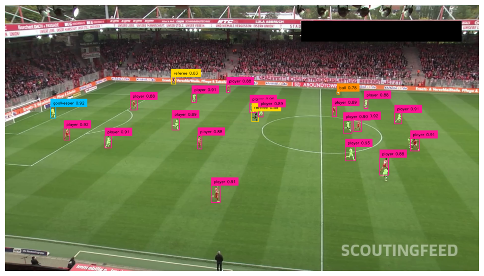
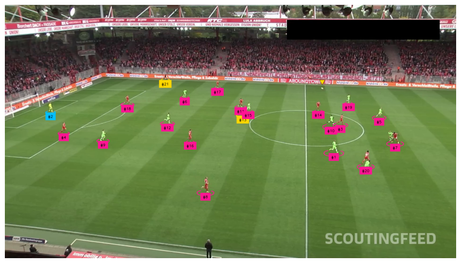
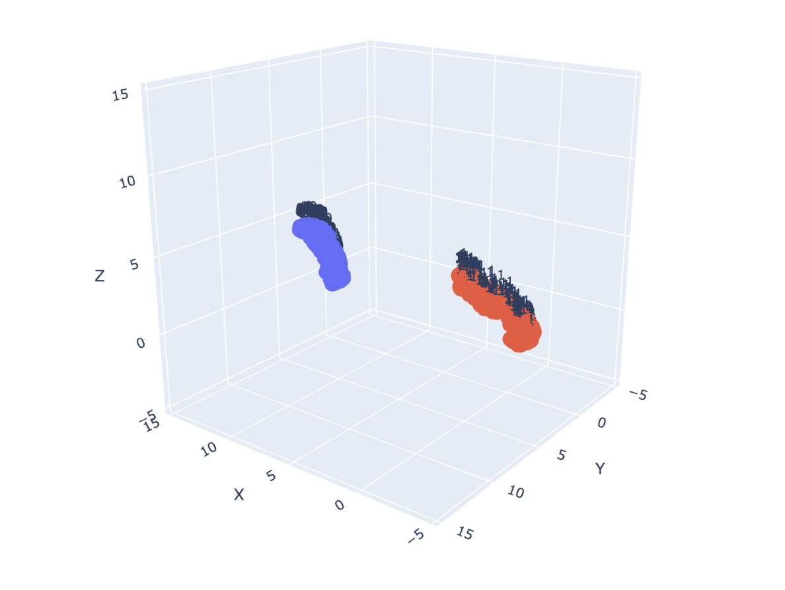
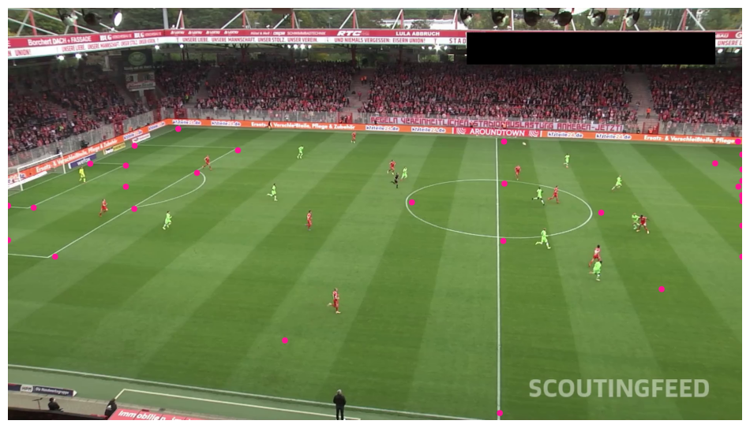
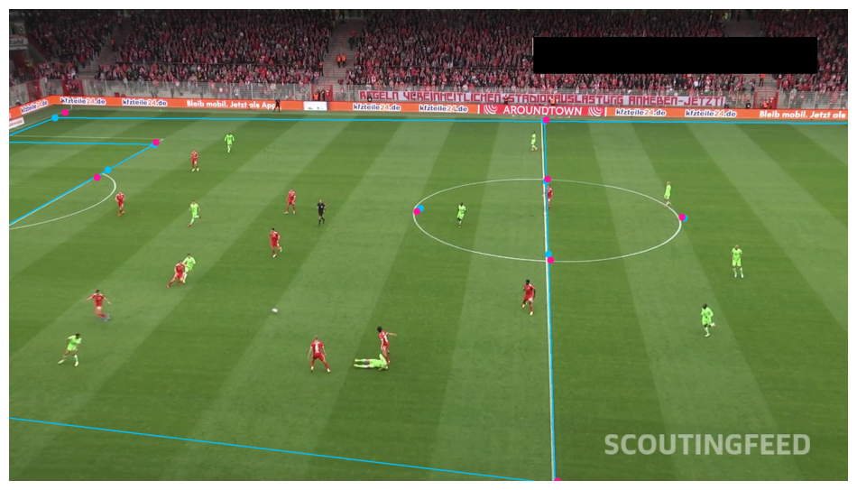
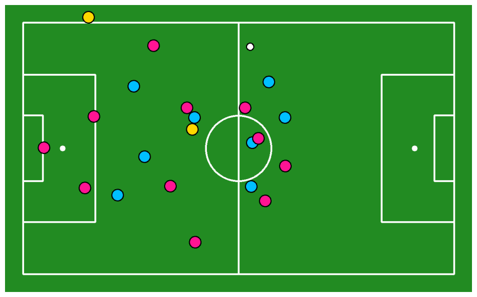
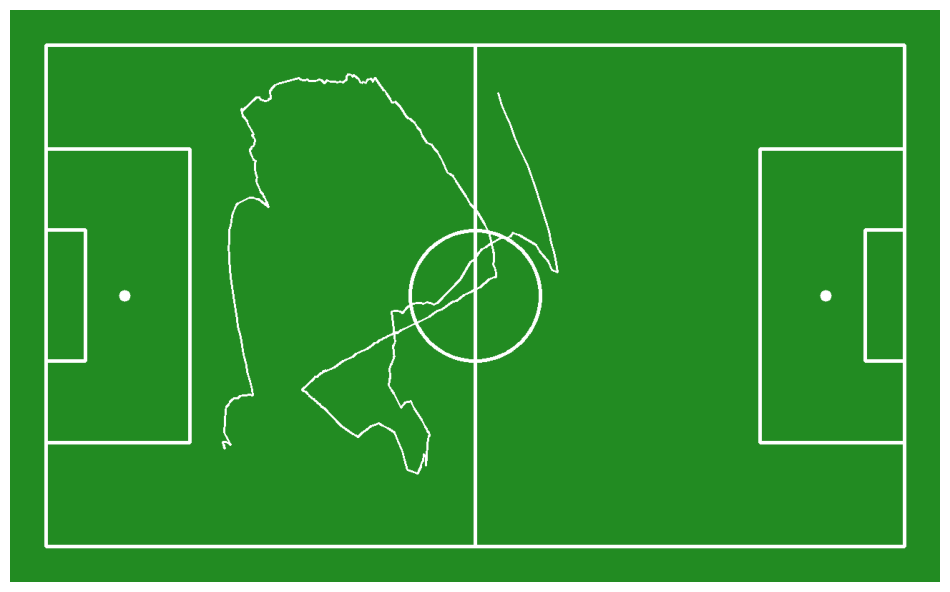

# Football AI: Computer Vision for Sports Analytics

This project builds an **AI-powered football analysis system** using computer vision and deep learning.  
It detects and tracks players and the ball in match footage, identifies teams, and calculates key metrics such as ball possession and player speed.

The project demonstrates how to combine **object detection**, **multi-object tracking**, **unsupervised clustering**, and **camera calibration** to extract insights from sports video data.

---

## Overview

### Workflow

1. **Setup**
   - Install dependencies and configure API keys for Hugging Face and Roboflow.
   - Enable GPU acceleration for efficient model inference.

2. **Data & Model Loading**
   - Retrieve pre-trained models via the **Roboflow API**.
   - Load object detection networks (e.g., **YOLOv8**) to recognize players, referees, and the ball.

3. **Object Detection**
   - Detect entities in each video frame.
   - Annotate detections with class labels and confidence scores.
   - Each detection returns bounding box coordinates `(x_min, y_min, x_max, y_max)` and class probabilities.

4. **Object Tracking**
   - Apply **SORT** (Simple Online and Realtime Tracking) or **ByteTrack** algorithms to maintain consistent player and ball identities across frames.
   - Tracking uses a **Kalman Filter** for motion prediction and **IoU matching** to associate new detections with existing tracks.

5. **Team Classification**
   - Extract dominant color features from detected player regions.
   - Use **K-Means clustering** in RGB color space to separate players into teams based on jersey color.
   - Cluster centroids are then used to label players as belonging to *Team A* or *Team B*.

6. **Camera Calibration**
   - Define homography between 2D image coordinates and 3D pitch coordinates using known reference points.
   - This enables mapping of player positions to real-world pitch coordinates.
   - Distances, speeds, and zones can then be calculated in meters rather than pixels.

7. **Performance Analytics**
   - Compute statistics such as:
     - Ball possession time per team
     - Average player speed (using frame-to-frame displacement and FPS)
     - Total distance covered
   - Visualize player trajectories, pass maps, and movement heatmaps.

---

## Tools and Technologies

| Tool / Library | Purpose | Description |
|----------------|----------|--------------|
| **OpenCV** | Core computer vision library | Frame extraction, visualization, transformations |
| **Roboflow SDK** | Model management | Access pre-trained detection models via API |
| **Hugging Face Hub** | Model authentication | Stores access tokens for model use |
| **Ultralytics YOLOv8** | Object detection | Detects players, ball, and referees |
| **NumPy / Pandas** | Data processing | Statistical calculations and tabular analysis |
| **Matplotlib / Seaborn** | Plotting | Visual analytics for player tracking and heatmaps |
| **SORT / ByteTrack** | Multi-object tracking | Maintains consistent IDs for players and ball |
| **K-Means Clustering** | Team classification | Groups players by jersey color features |
| **Homography Estimation** | Camera calibration | Maps image coordinates to real-world pitch coordinates |

---

## Key Visuals


### 1. System Overview


### 2. Object Detection Example


### 3. Player Tracking


### 4. Team Classification



### 5. Camera Calibration




### 6. Match Analytics




---

## Getting Started

1. **Clone this repository**
   ```bash
   git clone https://github.com/jackhenry02/football_computer_vision_ai.git
   cd football_computer_vision_ai
   ```

2. **Install dependencies**
   ```bash
   pip install -r requirements.txt
   ```

3. **Set up environment variables**
   - Create API tokens on:
     - [Hugging Face Tokens](https://huggingface.co/settings/tokens)
     - [Roboflow API Key](https://app.roboflow.com/settings/api)
   - Store them securely (e.g., using environment variables or `.env`).

4. **Run the notebook**
   ```bash
   jupyter notebook football_ai.ipynb
   ```

---

## Results

After running the full pipeline, you’ll be able to:
- Track every player and the ball in real time  
- Estimate speed and distance covered  
- Calculate ball possession  
- Visualize match dynamics through annotated frames and plots  

---

## Potential Extensions

- Automatic **highlight generation** based on events  
- Tactical visualization (e.g., heat zones, formation tracking)  
- Integration with real-time match feeds  
- Player performance dashboards  

---

## Acknowledgements

- [Roboflow](https://roboflow.com) — Dataset and model hosting  
- [Ultralytics YOLOv8](https://github.com/ultralytics/ultralytics) — Object detection backbone  
- [Hugging Face](https://huggingface.co) — Model and dataset access hub  

---
